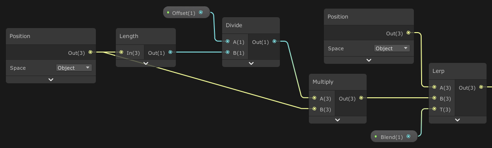
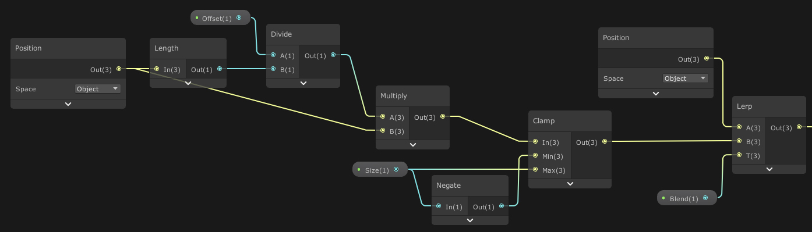

# Morph Effect

Vertex shader that morphs geometry into primitive shapes.

	 

To morph into a sphere the vertices are expanded.

	 

To morph into a cube the vertices are expanded and clamped to fit the cube dimensions.

	 

References.
> [Graphic Shaders, Chapter 16](http://web.engr.oregonstate.edu/~mjb/cgeducation/ShadersBookSecond/)
